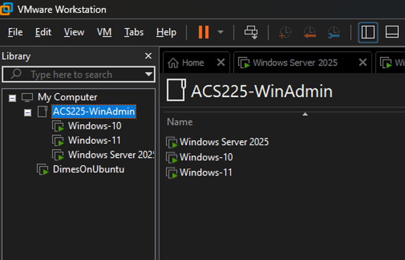
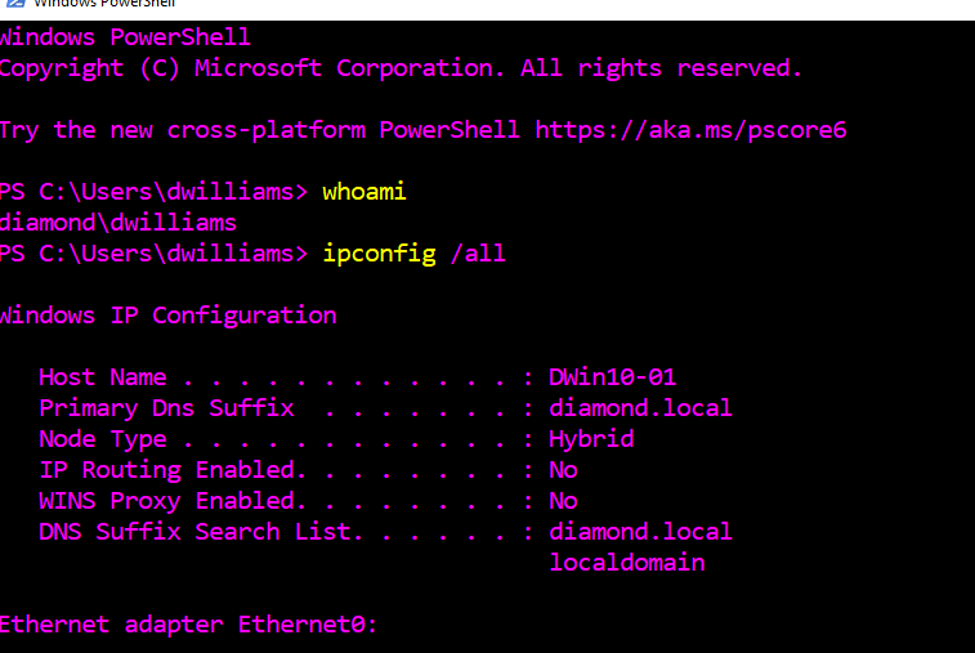

### 🖥️ Cybersecurity Home Lab

This repository documents my personal cybersecurity home lab built using VMware Workstation. The environment originally began as a Windows administration lab and has since expanded into a multi-system environment that I use to practice system administration, Linux, networking, security hardening, and cybersecurity testing.

## 🖥️ Original Lab Build

The original environment was built around a Windows domain and included:

- Windows Server
- Windows client systems
- Active Directory Domain Services (AD DS)
- DNS
- Domain user administration
- Domain-joined Windows clients
- VMware Workstation virtualization

### VMware Lab Environment

### Windows Domain Configuration

This provided a dedicated environment where I could practice Windows Server and Active Directory administration outside of temporary classroom lab environments.

## 🐧 Linux Expansion

After completing the original Windows environment, I expanded the home lab with multiple Linux systems, including:

- Ubuntu Linux
- AlmaLinux
- Kali Linux
- Linux command-line administration
- User and group management
- Service configuration
- Firewall and system security configuration

The Linux systems provide environments for administration, security hardening, network testing, and practicing cybersecurity techniques alongside the Windows domain environment.

## 🔐 System Hardening

I have used the lab to practice security hardening techniques on my virtual machines.

Activities have included:

- Reviewing running services
- Disabling or removing unnecessary services
- Configuring host-based firewall rules
- Reviewing user and group access
- Strengthening system configurations
- Testing system functionality after security changes

## 🔎 Network Scanning & Security Testing

Kali Linux provides a dedicated system for security testing within the lab.

I have used Nmap to practice:

- Host discovery
- Port scanning
- Service identification
- Network enumeration
- Reviewing exposed services
- Comparing scan results before and after configuration changes

All scanning and security testing is performed against systems within my personal lab environment.

## 🛠️ Technologies & Skills

- VMware Workstation
- Windows Server
- Windows 10/11
- Active Directory
- DNS
- PowerShell
- Ubuntu Linux
- AlmaLinux
- Kali Linux
- Linux Administration
- Nmap
- Network Scanning
- System Hardening
- Firewall Configuration
- Virtualization
- TCP/IP Networking
- Cybersecurity Testing

## 🚀 Continued Development

This home lab is an ongoing environment that I can continue expanding as I develop additional cybersecurity skills. Future configurations, security testing, tools, and systems can be added without affecting production environments.

The lab provides a dedicated environment for experimenting, troubleshooting, practicing administration, and applying cybersecurity concepts beyond structured coursework.
